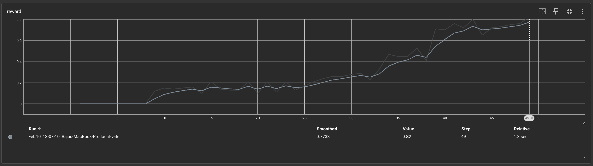
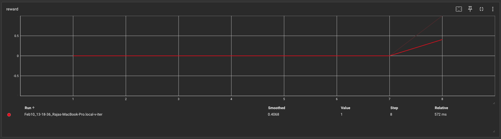
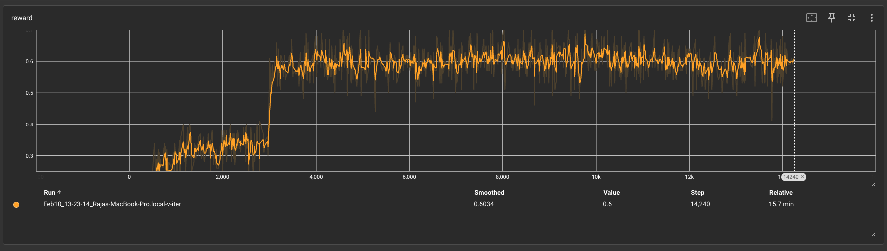
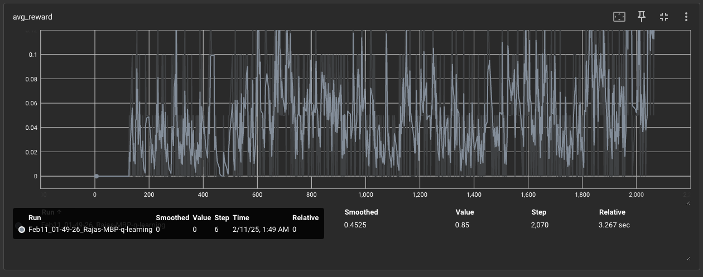

# Frozenlake-RL: Solving the Frozenlake Problem with RL Algorithms

This repository contains implementations of various **Reinforcement Learning (RL) algorithms** to solve the **Frozenlake-v1** environment from OpenAI Gym.

---

## Getting Started

### Prerequisites
Ensure you have the following installed before running the scripts:
- Python 3.x
- OpenAI Gym
- PyTorch

You can install the requirements for the repo using the following command:
```bash
pip install -r requirements.txt
```

To run the training scripts, 
```bash
python3 value_iteration_frozenlake.py
```
```bash
python3 q_iteration_frozenlake.py
```

The logs during training appear like the following:
```bash
updating best reward from 0.0 to 0.12
updating best reward from 0.12 to 0.15
updating best reward from 0.15 to 0.16
updating best reward from 0.16 to 0.21
updating best reward from 0.21 to 0.24
updating best reward from 0.24 to 0.26
updating best reward from 0.26 to 0.28
updating best reward from 0.28 to 0.29
updating best reward from 0.29 to 0.33
updating best reward from 0.33 to 0.47
updating best reward from 0.47 to 0.53
updating best reward from 0.53 to 0.71
updating best reward from 0.71 to 0.76
updating best reward from 0.76 to 0.8
updating best reward from 0.8 to 0.82
Solved in 49 iterations
```

The average reward graph when using value iteration is shown below for slippery frozen lake:
<table>
  <tr>
    <td></td>
  </tr>
</table>

for non slippery frozen lake:
<table>
  <tr>
    <td></td>
  </tr>
</table>

for slippery 8x8 frozen lake:
<table>
  <tr>
    <td></td>
  </tr>
</table>

convergence of reward in 4x4 FrozenLake using q-learning:
<table>
  <tr>
    <td></td>
  </tr>
</table>

